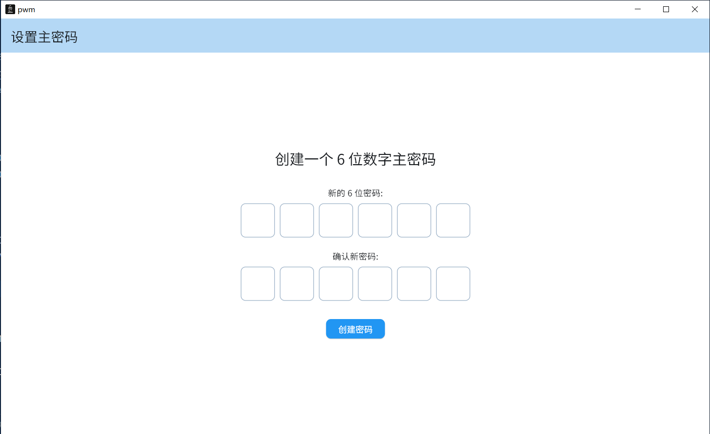
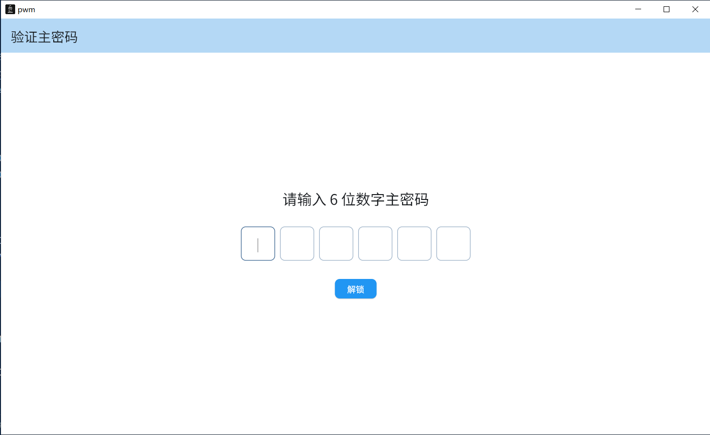
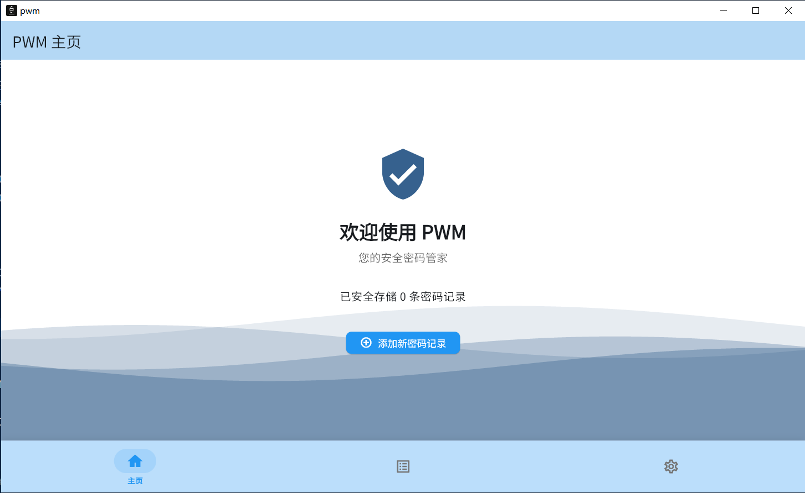
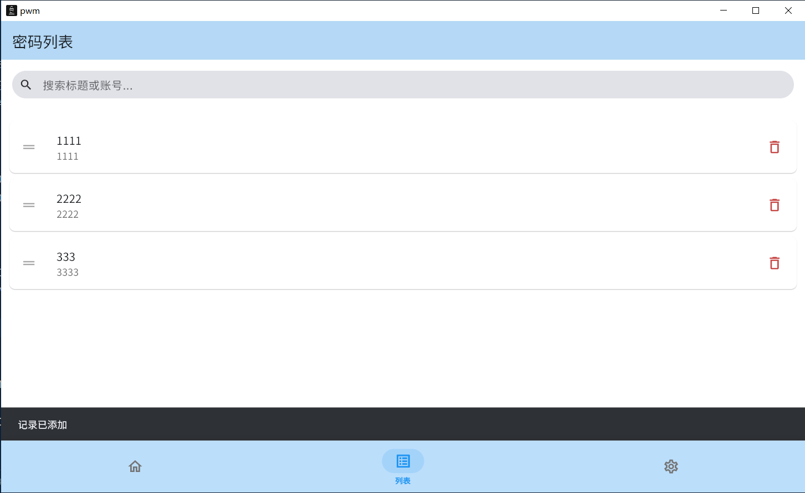
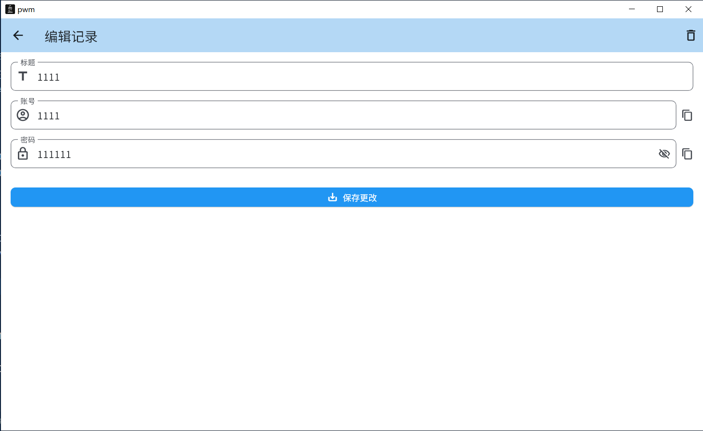
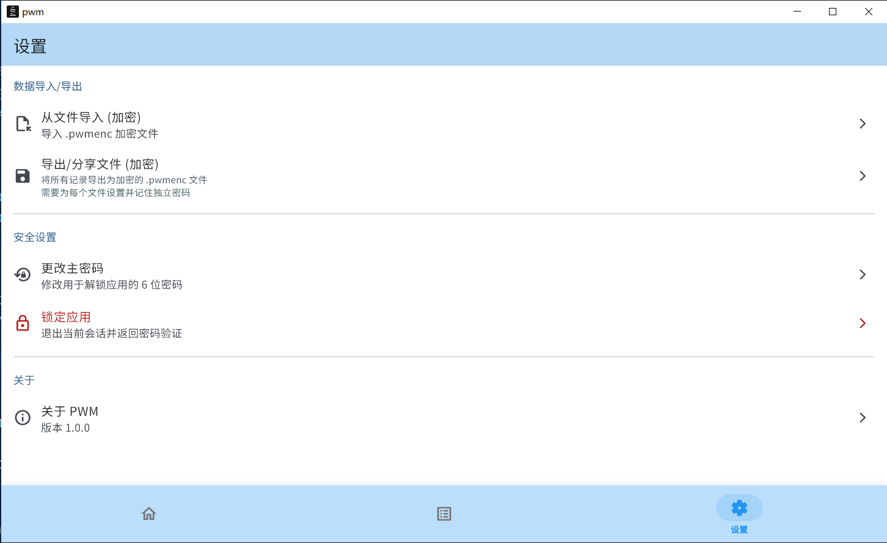

# PWM密码管理器

一个使用AI,基于 Flutter 构建的本地密码管理器，注重安全和易用性。

## 功能

*   安全存储密码
*   密码生成器
*   数据导入/导出

## 平台

*   Windows
*   android

## 预览图

##

## 技术栈

*   Flutter
*   Riverpod
*   Hive

## 许可证

MIT License

Copyright (c) 2025 Harrison
